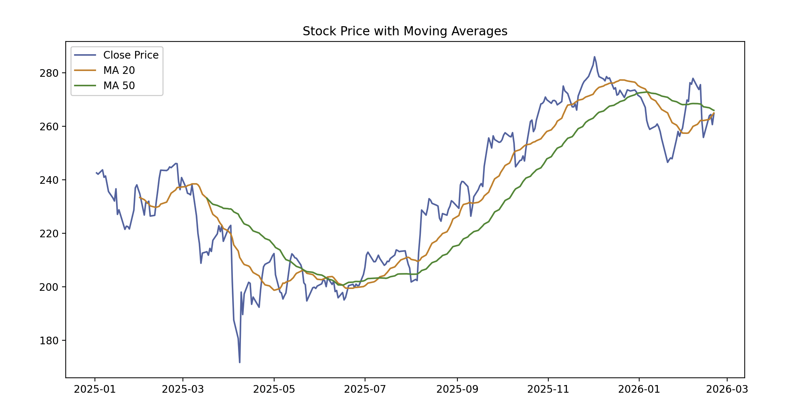

```markdown
# Data Pipeline Project: Stock Prices

This repository demonstrates a production-style data pipeline for stock prices. It fetches financial data via API, cleans it, stores it in PostgreSQL, computes analytics (such as moving averages, volatility, min/max prices), and visualizes results. The project is modular, production-ready, and suitable for showcasing Data Analyst / Automation skills.

---

## Features

- Fetch historical stock/cryptocurrency data via API
- Clean and preprocess raw data
- Store processed data in PostgreSQL
- Compute analytics: moving averages (MA20, MA50), volatility, returns, min/max prices
- Visualize trends and indicators with Matplotlib/Seaborn
- Modular Python code with configuration management
- Interactive exploration via Jupyter Notebook

---

## Repository Structure

```

data_pipeline_project/
├─ assets/
│   └─ plot_example.png
├─ config.py
├─ README.md
├─ main.py
├─ modules/
│   ├─ data_fetcher.py
│   ├─ data_cleaner.py
│   ├─ database.py
│   ├─ analytics.py
│   ├─ analyzer.py
│   └─ visualizer.py
└─ notebooks/
    └─ exploration.ipynb
└─ requirements.txt

````

---

## Installation

```bash
git clone https://github.com/<your-username>/<repo>.git
cd data_pipeline_project
python -m venv venv
source venv/bin/activate
pip install -r requirements.txt
````

---

## Configuration

```python
TICKER = "AAPL"
DB_CONFIG = {
    "host": "localhost",
    "port": 5432,
    "database": "stocks",
    "user": "your_user",
    "password": "your_password"
}
```

---

## Usage

```bash
python main.py
```

---

## Jupyter Notebook

Open `notebooks/exploration.ipynb` to interactively explore the full dataset, compute 
analytics, and visualize trends.

---

## Technologies

* Python 3.9+
* Pandas, NumPy
* Matplotlib, Seaborn
* PostgreSQL, SQLAlchemy, psycopg2
* yfinance API

---

## Example Visualization

Here is an example of the Close price with moving averages:



---

## License

MIT License

```
```

